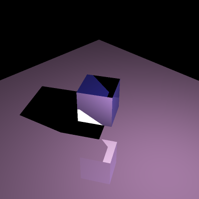
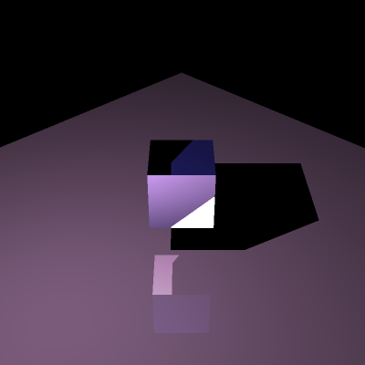
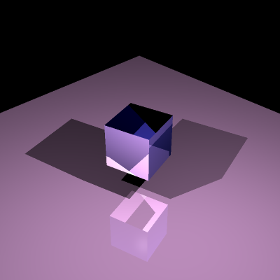
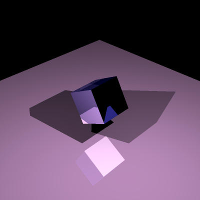
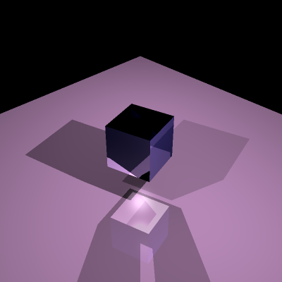
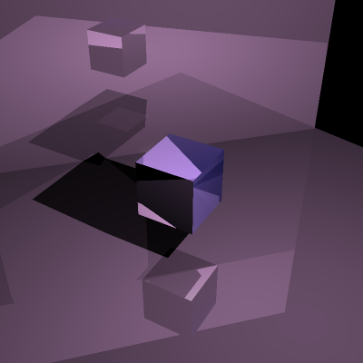

# JuRayTracer

A simple ray tracer implemented in pure Julia  
Just for fun  

------

I learned the basics of ray tracing from [TU Wien Rendering / Ray Tracing Course](https://www.youtube.com/playlist?list=PLujxSBD-JXgnGmsn7gEyN28P1DnRZG7qi)  
It's a great series of introductory courses  

-----

See `notes.md` for the necessary formulas and notations for this topic  

-----

Cube and Plane (single light source)  
  
  

Cube and Plane (double light sources)  
  
  

Cube and Plane (multiple light sources)  
  

Cube and 2 Planes (single light source)  
  